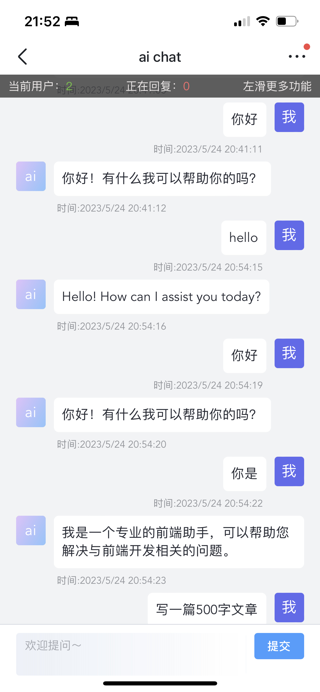

<!--
 * @Author: huhaibiao 
 * @Date: 2023-04-21 22:11:20
-->

# 其他项目推荐

## ai chat
体验地址：（欢迎友好提问哈，小服务器希望大家友好体验一下）
http://18.216.251.165/ai-chat
- 项目界面：

目前 账号：huhaibiao 密码是：1
- 开源代码：
前端：https://github.com/huhaibiao/aichat
后端：https://github.com/huhaibiao/openai-api

vite + vue3 + ts + vue-router + pinia

# 这个demo框架
- 初步具备：vite 、vue3 、 ts、vue-router 、pinia
- ui框架具备 elementPlus和elementUI按需导入

# h5项目仓库

## 数字方块消消预览地址：
1. 小服务器地址：http://18.216.251.165:8090/
2. vercel地址：https://h5-lilac.vercel.app/

# 分支说明：
- main:为正式分支，master会不定期合并dev分支
- dev: 为开发分支，如果需要提交，请提交到该分支
 
# 项目运行
1. ```pnpm i``` 安装依赖
2. ``` pnpm dev ``` 本地运行
3. ``` pnpm build ``` 项目打包


# h5产品1
## 数字方块消消
1. 相邻区域算法 ✅
2. 使用elementUI <button>组件玩法 ✅
3. button元素向下落 ✅
4. 使用worker动态计算是否可消除 ✅
5. localstorage本地存储数据，保存此局 ✅
6. 响应式动态变化兼容 ✅
7. 关卡切换功能 ✅

